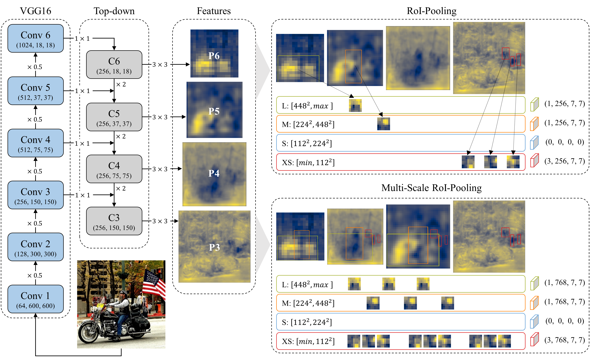

# Feature Pyramid Network

- Pytorch implementation of Feature Pyramid Network based on VGG16 and ResNet101.
- Supports multi-scale RoI pooling.
- This project is based on [simple-faster-rcnn-pytorch](https://github.com/chenyuntc/simple-faster-rcnn-pytorch/), [fpn.pytorch](https://github.com/jwyang/fpn.pytorch), and [bounding-box](https://github.com/nalepae/bounding-box).
- [A dockerized test environment](https://hub.docker.com/repository/docker/stnamjef/pytorch-fpn) is available.

## 1. Introduction



- Feature Pyramid Network based on VGG16.
  - The two fully connected layers, fc6 and fc7, are converted into convolutional layers as in SSD.
  - The model uses four levels of features (P3, P4, P5, P6) as shown in the image above.
  - Anchor scales are [64^2, 128^2, 256^2, 512^2], and aspect ratios are [0.5, 1, 2].
- Multi-scale RoI pooling.
  - Original FPN pools RoI from single-level features. As shown in the upper right of the image, large-sized RoIs are pooled from small-scale features, while small-sized RoIs are pooled from large-scale features.
  - Multi-scale RoI pooling uses multiple levels of features to pool RoI. Since the original FPN use single-level features, there are three additional levels of features available for RoI pooling. I found that using three levels of features is the most effective in terms of detection performance. You can specify the number of features to use for RoI pooling with --n_features option.

## 2. Benchmarks

- Detection results on PASCAL VOC 2007 test dataset
  - All models were evaluated using COCO-style detection evaluation metrics.
  - FPN+ is FPN with multi-scale RoI pooling adopted. 
  - Learning rate : 0.001 for the first 50k images, 0.0001 for the next 25k; input size: 600px, batch size: 1; weight decay: 0.0005; momentum: 0.9.

| Training dataset |    Model     |    AP     |  AP@0.5   |  AP@0.75  |   AP(s)   |   AP(m)   |   AP(l)   |
| :--------------: | :----------: | :-------: | :-------: | :-------: | :-------: | :-------: | :-------: |
|      VOC 07      | Faster R-CNN |   35.10   |   69.85   |   30.71   |   4.59    |   20.77   |   38.62   |
|      VOC 07      |     FPN      |   36.28   |   68.92   |   33.93   | **18.06** |   22.99   |   37.88   |
|      VOC 07      |     FPN+     | **39.09** | **71.18** | **37.89** |   16.21   | **24.65** | **41.25** |
|   VOC 07 + 12    | Faster R-CNN |   42.73   |   75.12   |   42.49   |   7.79    |   26.47   |   46.50   |
|   VOC 07 + 12    |     FPN      |   43.69   |   75.43   |   44.79   | **18.32** |   28.99   |   45.49   |
|   VOC 07 + 12    |     FPN+     | **45.35** | **76.03** | **47.30** |   18.04   | **30.69** | **47.51** |

## 3. Requirements

- Python 3.8.0
- Pytorch 1.7.1 (CUDA 10.2)
- OpenCV
- tqdm
- torchnet
- pycocotools
- scikit-image

## 4. Usage

### 4.1. Data preparation

- Download the training, validation, and test data.

```shell
# VOC 2007 trainval and test datasets
wget http://host.robots.ox.ac.uk/pascal/VOC/voc2007/VOCtrainval_06-Nov-2007.tar
wget http://host.robots.ox.ac.uk/pascal/VOC/voc2007/VOCtest_06-Nov-2007.tar
# VOC 2012 trainval dataset
wget http://host.robots.ox.ac.uk/pascal/VOC/voc2012/VOCtrainval_11-May-2012.tar
```

- Extract all of these tars into one directory named VOCdevkit

```shell
# VOC 2007 trainval and test datasets
tar xvf VOCtrainval_06-Nov-2007.tar
tar xvf VOCtest_06-Nov-2007.tar
# VOC 2012 trainval dataset
tar xvf VOCtrainval_11-May-2012.tar
```

- It should have the structure as below. If you want to use something other than "dataset" as the directory name, you should specify it in the --dataset option.

```shell
project
├── dataset
│   ├── COCO
│   │   ├── annotations
│   │   │   └── deprecated-challenge2017
│   │   └── images
│   │       ├── test2017
│   │       ├── train2017
│   │       ├── unlabeled2017
│   │       └── val2017
│   └── VOCdevkit
│       ├── VOC2007
│       │   ├── Annotations
│       │   ├── ImageSets
│       │   ├── JPEGImages
│       │   ├── SegmentationClass
│       │   └── SegmentationObject
│       └── VOC2012
│           ├── Annotations
│           ├── ImageSets
│           ├── JPEGImages
│           ├── SegmentationClass
│           └── SegmentationObject
└── feature_pyramid_network
    ├── data
    ├── models
    │   ├── rpn
    │   └── utils
    ├── model_zoo
    └── utils
```

### 4.2. Build and run the docker image

**I will assume the current working directory is "project" as shown in the above code fence.**

- Build the dockerfile (Skip this part if you want to use the pre-built docker image).

```shell
docker build -t stnamjef/pytorch-fpn:1.0 ./feature_pyramid_network
```

- Run the docker image.

```shell
# run the docker image
docker run -it -v $(pwd):/workspace --gpus all --ipc host stnamjef/pytorch-fpn:1.0
```

### 4.3. Train models

**Now the current working directory is "/workspace/feature_pyramid_network" in the docker container.**

- Ex 1) FPN based on VGG16 (default model)

```shell
python3 ./train.py --model=fpn --backbone=vgg16 --n_features=1 --dataset=voc07
```

- Ex 2) FPN based on ReNet101

```shell
python3 ./train.py --model=fpn --backbone=resnet101 --n_features=1 --dataset=voc07
```

- Ex 3) FPN with multi-scale RoI pooling (three features)

```shell
python3 ./train.py --model=fpn --backbone=vgg16 --n_features=3 --dataset=voc07
```

- Ex 4) Faster R-CNN based on VGG16 (currently Faster R-CNN does not support ResNet101)

```shell
python3 ./train.py --model=frcnn --backbone=vgg16 --dataset=voc07
```

### 4.4. Test models

**File (pretrained weights) naming format: "model_backbone_nfeatures.pth".** 

- Ex 1) FPN based on VGG16 (file name: "fpn_vgg16_1.pth")

```shell
python3 ./test.py --model=fpn --backbone=vgg16 --n_features=1 --dataset=voc07 --save_dir=./model_zoo
```

- Ex 2) Faster R-CNN based on VGG16 (file name: "frcnn_vgg16.pth")

```shell
python3 ./test.py --model=frcnn --backbone=vgg16 --dataset=voc07 --save_dir=./model_zoo
```

### 4.5. Plot predictions

All plots will be saved in the "./results" folder.

- Ex) FPN based on VGG16

```shell
# plot predictions for the first 10 images
python3 ./plot.py --model=fpn --backbone=vgg16 --n_features=1 --dataset=voc07 --save_dir=./model_zoo --n_plots=10
```

## 5. CLI options

| Options           | dtype  | description                                                  |
| ----------------- | ------ | ------------------------------------------------------------ |
| --model           | string | Model name (options: frcnn, fpn; default: fpn)               |
| --backbone        | string | Backbone network (options: vgg16, resnet101; default: vgg16) |
| --n_features      | int    | The number of features to use for RoI poolig (default: 1)    |
| --dataset         | string | Dataset name (options: voc07, voc0712, coco; default: voc07) |
| --data_dir        | string | Dataset directory (default: ../dataset)                      |
| --save_dir        | string | Saving directory (default: ./model_zoo)                      |
| --min_size        | int    | Minimum size of input image (default: 600)                   |
| --max_size        | int    | Maximum size of input image (default: 1000)                  |
| --n_workers_train | int    | The number of workers for a train loader (default: 8)        |
| --n_workers_test  | int    | The number of workers for a test loader (default: 8)         |
| --lr              | float  | Learning rate (default: 1e-3)                                |
| --lr_decay        | float  | Learning rate decay (default: 0.1; 1e-3 -> 1e-4)             |
| --weight_decay    | float  | Weight decay (default: 5e-4)                                 |
| --epoch           | int    | Total epochs (default: 15)                                   |
| --epoch_decay     | int    | The epoch to decay learning rate (default: 10)               |
| --nms_thresh      | float  | IoU threshold for NMS (default: 0.3)                         |
| --score_thresh    | float  | BBoxes with scores less than this are excluded (default in train and test mode: 0.05; default in plot mode: 0.6) |
| --n_plots         | int    | The number of images to plot predictions (default: -1; all images) |

