# 소프트웨어융합캡스톤디자인


본 글은 2020-2학기 캡스톤디자인 과목에서 수행한 프로젝트를 정리하기 위해 작성한 것입니다. 프로젝트의 주요 내용을 요약하여 작성했고, 아직 완료되지 않은 부분은 계속해서 보완할 예정입니다.


## 1. Overview


#### 주제: Feature extractor 구조에 따른 object detector의 성능 차이 분석


### 1) Feature extractor


이러한 특징을 추출하기 위해 과거에는 아래의 (a)와 같이 입력 이미지를 다양한 스케일로 변환한 후 각각의 이미지에서 독립적으로 feature을 추출하는 방법을 사용하였다. 하지만 이 방법은 계산 비용이 많이 들어 비효율적이라는 단점이 있다.


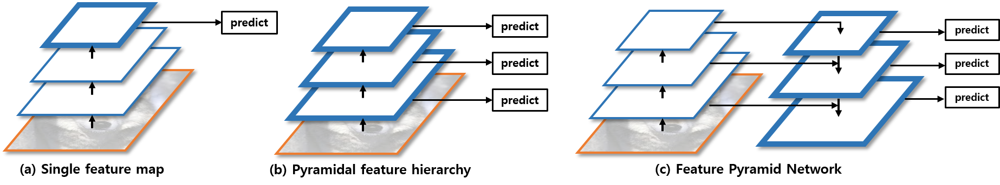


객체 탐지(object detection) 분야에서 스케일 변화에 강건한 feature를 찾는 것은 중요한 과제 중 하나이다. (a)는 신경망이 마지막으로 추출하는 feature를 이용해 객체 탐지를 한다. Faster R-CNN, YOLO v1이 이러한 방법을 적용한 대표적 예시이다. 합성곱 신경망에서 추출되는 feature는 스케일 및 위치 변화에 강건하기 때문에 객체를 탐지하고 분류하는 작업에 적합하다. 하지만 합성곱 신경망의 구조적 특성상 층을 거듭할수록 feature의 스케일이 작아져서 작은 물체를 탐지하는 데 어려움이 있다. 작은 물체의 경우 풀링(pooling) 연산을 여러번 거듭하면 픽셀 정보가 완전히 사라질 수도 있기 때문이다. 

(b)는 큰 스케일의 feature를 함께 이용하여 작은 물체도 잘 탐지할 수 있도록 고안된 방법이다. 이를 적용한 대표적인 모델에는 SSD가 있다. SSD300은 PASCAL VOC2012 test 데이터를 기준으로 mAP가 72.4인데, 이는 Faster R-CNN(70.4), YOLOv1(57.9)보다 높은 수치이다[4]. 이처럼 SSD는 큰 스케일의 feature를 함께 이용하면 mAP가 향상 될 수 있음을 보였다. 하지만 스케일이 큰 feature, 다시 말해 low-level feature는 공간 정보는 잘 보존하지만 semantic은 떨어진다. 강한 semantic을 갖는 feature는 객체 탐지에 유리하기 때문에, low-level feature가 강한 semantic을 가질 수 있도록 한다면 mAP가 더 향상될 것이라 기대할 수 있다.

(c)는 모든 수준의 feature에서 강한 semantic을 갖도록 고안된 방법이다. 이 방법은 위의 그림에서 보이는 것과 같이 high-level feature의 스케일을 키워가면서 이전에 추출한 feature들과 합하는 방식으로 작동한다. 이는 high-level feature가 갖는 강한 semantic을 low-level feature도 가질 수 있도록 하기 위함이다. Faster R-CNN에 이 방법을 적용했을 때 COCO minival 데이터를 기준으로 AP@0.5가 5.2 상승했다[3].

이처럼 객체 탐지에 더 유리한 feature extractor를 찾는 연구는 지속되어 왔다. 그러나 이러한 구조적 차이가 성능을 높이는 이유에 대한 연구는 미진하다. 예를 들어 (a)에 비해 (b)가 큰 스케일의 feature를 함께 사용하여 작은 물체를 더 잘 탐지할 수 있다고 하지만 신경망 내부에서 어떻게 작동하는지 잘 알지 못 한다. 또한 (b)에 비해 (c)가 모든 level의 feature에서 강한 semantic을 갖는다고 하지만 실제 feature들 간 어떠한 차이가 있는지 알지 못 한다. 따라서 본 연구에서는 (a), (b), (c) 세 가지 feature extractor가 추출하는 feature들을 시각화하여 그것들 간 어떠한 차이가 있는지 분석하고, 어떠한 이유로 object detector의 성능이 향상되는지를 알아보고자 한다.


### 2) Feature visualization


[1]은 합성곱 신경망의 각 층에서 생성되는 feature를 입력 이미지 공간에 사상하여 분석하는 방법을 제시했다. 쉽게 말해 컨볼루션, 풀링과 같은 합성곱 신경망의 연산을 거꾸로 시행하여 feature activation의 스케일을 증가시키는 방법이다. 이를 통해 각 feature가 입력 이미지의 어떤 부분에 반응하여 활성화 되는지를 파악할 수 있다. 예를 들어 아래의 가장 오른쪽 feature처럼 눈이 활성화 되어 있다면, 해당 feature는 늑대를 분류할 때 눈이 분별력 있는 요소라고 판단한 것이다.


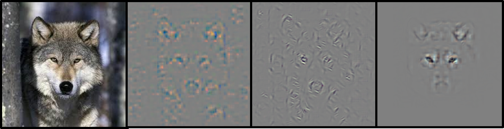


본 연구에서는 이러한 방법을 앞서 설명한 세 가지 feature extractor를 분석하는 데 사용하고자 한다. 먼저 (a), (b), (c) 세 가지 feature extractor를 적용할 기본 모델로 Faster R-CNN(VGG-16)을 사용한다. 앞서 설명한 바와 같이 Faster R-CNN의 feature extractor는 (a) 구조를 하고 있다. 이에 따라 이 모델의 feature extractor를 약간 수정하여 (b), (c) 구조로 변경하고, 각 모델의 성능을 측정한 후 서로 비교 분석한다. (a)와 (b)를 비교할 때는 스케일이 큰 feature가 작은 물체를 탐지하는 데 용이한지를 중점적으로 검증한다. 또한 (b)와 (c)를 분석할 때는 (c)에서 생성되는 feature가 모든 level에서 강한 semantic을 갖는지를 관찰하는 데 초점을 둔다. 마지막으로 모든 분석은 PASCAL VOC2007 데이터를 이용하여 진행한다. 아래는 분석을 위해 구축할 세 가지 모델을 그림으로 나타낸 것이다.


### 3) Network architecture


- (a) Faster R-CNN(Single feature map)


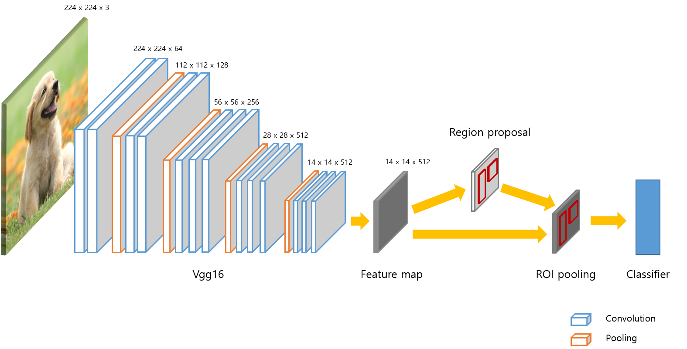


- (b) Faster R-CNN(Pyramidal feature hierarchy)


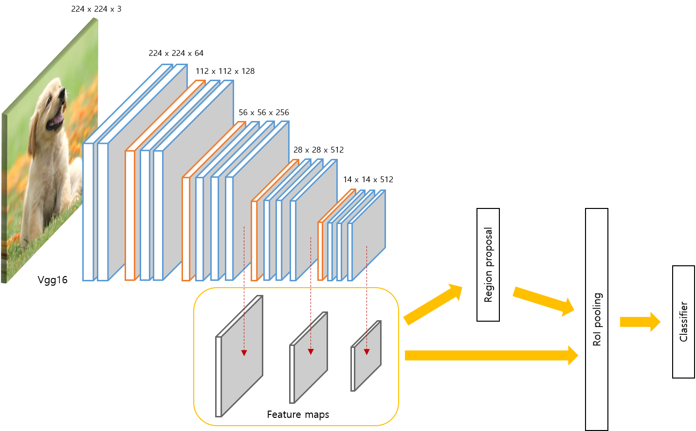


- (c) Faster R-CNN(Feature Pyramid Network)


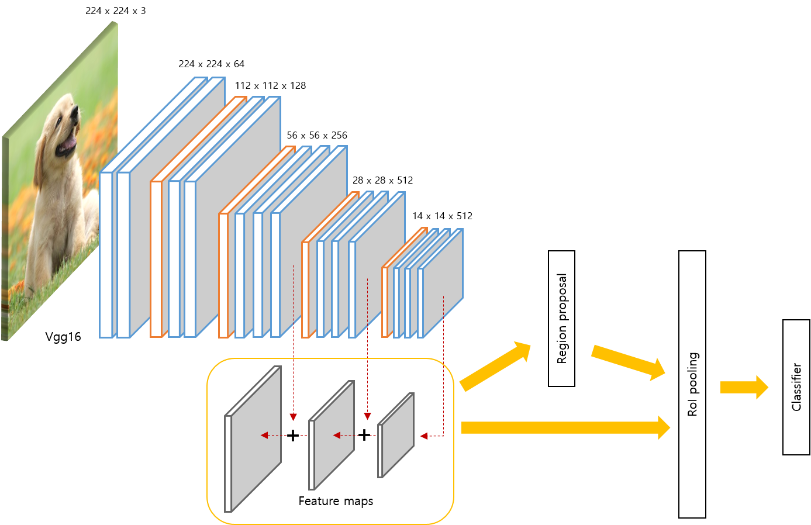


## 2. Results(tested on PASCAL VOC 2007 test)


### 1) 모델의 성능(mAP) 측정 결과


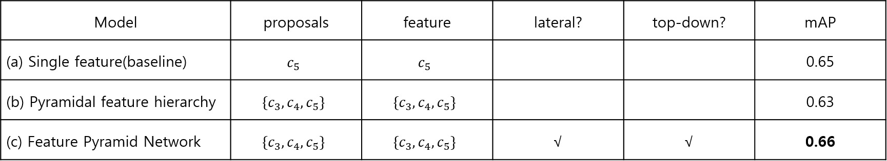


위는 앞서 설명한 세 가지 모델의 mAP를 측정하고 그 결과를 정리한 표이다. 먼저  {C3, C4, C5}는 각각 VGG-16의 세 번째, 네 번째, 그리고 다섯 번째 컨볼루션 층에서 생성한 feature라는 의미이다. 계속해서 proposal은 RPN(region proposal network)에서 사용하는 feature를 말한다. 예를 들어 proposal이 C5면, 이 모델의 RPN은  C5만을 사용하여 bounding-box regression과 classification을 한다. 다음으로 feature는 RoI를 pooling하는 데 사용하는 feature를 말한다. 예를 들어 이 값이 C5면, 모든 roi는 C5로부터 추출된다. 마지막으로 lateral과 top-down은 각각 그러한 구조를 채택했는지 여부를 나타낸다.

표에서 보듯이 (b)는 기존 모델보다 mAP가 약 0.02 정도 낮았다. 다양한 스케일의 feature를 사용하면 성능이 향상될 것이라 예상한 것과는 반대되는 결과였다. (c)은 기존 모델에 비해 mAP가 향상되었으나, 그 차이가 유의미하다고 할 만큼 크지 않았다. 이는 선행연구에서 Faster R-CNN에 (c)를 적용했을 때 기존의 모델보다 AP@0.5가 5.2 상승[3]했다는 사실에 부합하지 않는 결과였다. 물론 [3]에서 구성한 모델은 ResNet-50 기반에 COCO minival set으로 테스트 하였으나, 본 연구에서 구성한 모델은 VGG-16을 기반으로 하고 PASCAL VOC 2007 데이터를 사용했다는 점에서 차이가 있다.


### 2) Lateral, top-down connection의 효과


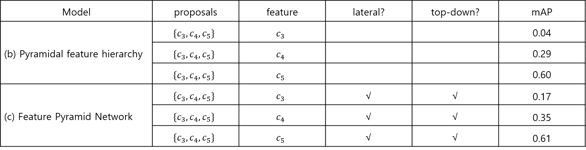


위는 (b), (c)에 대해 roi-pooling하는 feature를 하나씩으로 고정하여 mAP를 측정한 결과이다. 예를 들어 첫 번째 행은 (b) 모델을 사용하되 세 가지 feature {C3, C4, C5}를 사용하여 proposal을 생성하고 그것을 C3로부터만 roi-pooling한 결과를 나타낸다. 결과적으로 두 모델 모두 C5에서 roi-pooling을 했을 때 mAP가 가장 높았다. 그 다음은 C4, C5순으로 수치가 높았다. 이는C5가 여러 층을 거쳐 생성된 feature인 만큼 semantic이 강해 객체 탐지나 분류에 유리하여 생긴 결과라고 추측할 수 있다.

[3]은 이러한 high-level feature의 강한 semantic을 low-level feature도 갖게 하기 위해 lateral 및 top-down connection을 제안하였다. 구체적으로 high-level feature의 스케일을 키워서 low-level feature과 결합하는 식으로 새로운 feature를 생성하고, 이것으로 객체 탐지와 분류를 하는 방식이다. 위의 표에서 볼 수 있듯이 C3 또는 C4만을 사용했을 때, (b)에 비해 (c)의 mAP가 유의미하게 높았다. 이는 lateral, top-down 구조가 모델의 성능 향상에 도움을 준 결과라고 해석할 수 있다. 

그러나 (c)의 첫 번째, 두 번째 결과와 세 번째 결과가 지나치게 많이 차이난다는 점에서 모든 feature가 강한 semantic을 갖는다고 확신할 수는 없다. 이렇게 성능 차이가 나는 원인으로 모델의 head layer를 훈련시킬 때 C3, C4에서 얻은 feature보다 C5에서 얻은 feature가 더 많이 입력되었던 점을 들 수 있다. 즉  C5에 비해,  C3, C4에 대해서는 훈련이 덜 된 것이라 할 수 있다. 참고로 head layer는 네트워크의 가장 마지막 층에서 bounding box regression과 classification을 수행하는 두 개의 fully-connected layer를 말한다. 

이처럼 대다수의 proposal들이 C5에서 roi-pooling된 이유는 (c)의 구조적 특성 때문이다. 기본적으로 (c)은 proposal의 크기를 기준으로 어느 feature에서 roi-pooling을 할지 결정한다. 구체적으로는 다음의 식 k = floor{ k0 + log_2^(sqrt(w * h) / 224) } ... (k0 = 5)에서 얻는 값이 기준이 된다. 예를 들어 proposal의 크기가 224^2이라면 k = 5 이기 때문에, 해당 proposal은 C5에서 roi-pooling을 시행한다. 문제는 이렇게 계산한 값이 대부분 5가 되어, head layer에 입력되는 feature가 로 C5편중된다는 것이다.

이에 따라 위의 식에서 K0 = 4로 하여 C3, C4에서 roi-pooling이 되는 비중을 커지도록 변경한 후 모델을 다시 훈련시켰다. 아래의 표는 해당 모델을 평가한 결과이다. 우선 모델의 mAP가 0.66으로 K0 = 5로 한 위의 모델과 성능이 비슷하였다. 그러나 feature를 하나로 고정시켜 roi-pooling을 한 세 개의 결과는 위의 모델보다 편차가 줄어든 것을 확인할 수 있었다.


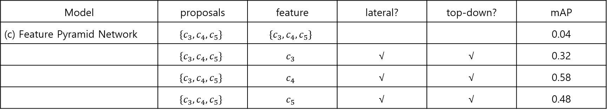


### 3) Feature 시각화


아래는 (a)에서 추출한 feature를 입력 이미지 공간에 mapping한 후 시각화 한 결과이다. 이때 feature의 모든 픽셀을 사용한 것이 아니라, 각 feature에서 가장 값이 큰 상위 1,000개의 픽셀만을 남기고 그 외의 픽셀은 모두 0으로 대체한 후 시각화하였다. 그렇게 한 이유는 각 feature에서 크게 활성화된 픽셀이 이미지의 어떤 부분인지를 파악하기 위해서이다. 왼쪽은 원본 입력 이미지이며, 오른쪽으로 갈수록 더 깊은 층에서 생성된 feature이다. 


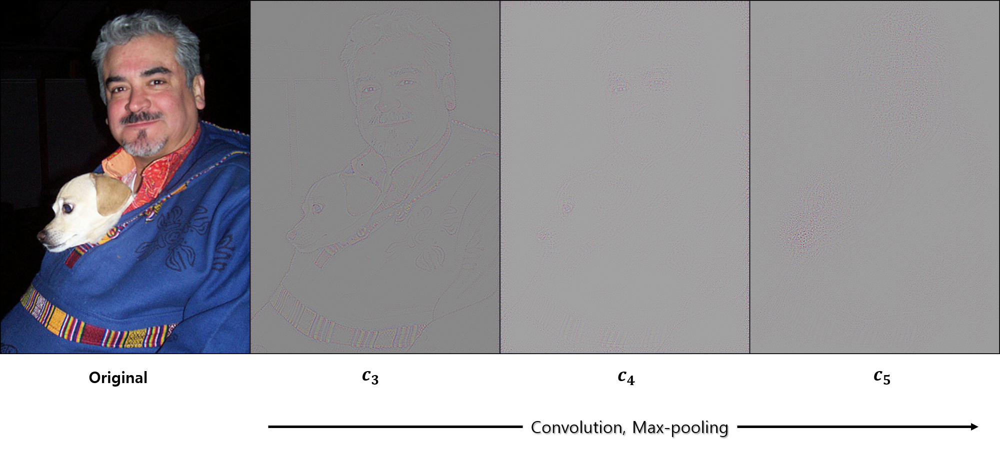


그림에서 볼 수 있듯이 low-level feature인 c3은 물체의 전체적인 윤곽선을 featur로 추출하였고, high-level feature인 c5은 사람이나 개의 얼굴과 같이 semantic이 강한 feature를 특징으로 추출하였다. 이로 보아 합성 신경망의 층을 많이 거듭할수록 feature의 semantic이 강해진다는 것을 알 수 있다.


- **c5 feature**


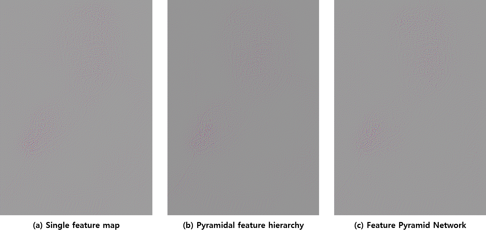


 [3]에 의하면 Faster R-CNN에 (c) 구조를 적용했을 때 low-level feature(c3, c4)에서도 high-level feature(c3)와 같이 강한 semantic이 나타나야 한다. 이를 알아보기 위하여 (a), (b), (c)의 각 층에서 생성된 feature를 시각화하여 비교하였다. 아래는 세 모델에서 생성된 high-level feature(c5)를 시각화 한 것이다. c5가 가장 high-level feature인 만큼 세 모델 모두 비슷하게 물체의 일부(얼굴 등)에 활성값이 몰려있는 것을 확인할 수 있었다. 


- **c4 feature**


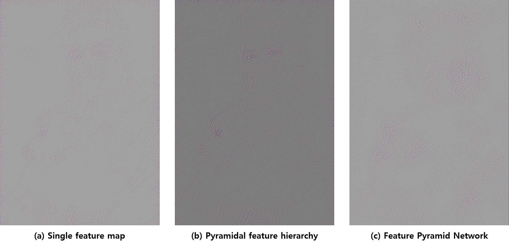


위는 세 모델이 생성한 c4 feature를 시각화한 것이다. 자세히 살펴보면 (a), (b)는 사람과 개의 눈에 특징점이 몰려있는데, 이는 얼굴 전반에 걸쳐 특징점이 퍼져있던 c5와 다른 모습이었다. 그러나 (c)의 경우 c5와 상당히 유사한 feature를 생성했다. 이는 lateral, top-down connection에 의해 c4가 상대적으로 강한 semantic을 갖게 된 결과라고 해석할 수 있다.


- **c3 feature**


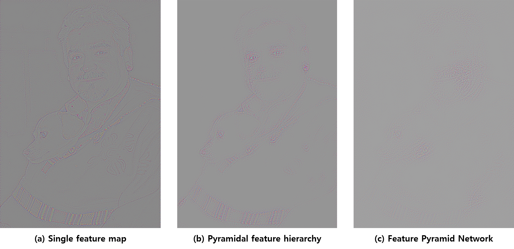


마지막으로 가장 low-level feature인 c3을 시각화한 결과이다. 확연하게 (a), (b)와 (c)가 서로 다른 feature를 생성하는 것을 알 수 있다. (a), (b)는 물체의 윤곽선에 특징점이 생성되어 전형적인 low-level feature의 특징을 보였으나, (c)는 여전히 사람과 개의 얼굴 일부분에 특징점이 생성되어 high-level feature의 강한 semantic을 일부 가지고 있음을 보여줬다. 이 역시 (c)의 lateral, top-down connection의 효과라 할 수 있다.


## 3. Conclusion


Faster R-CNN의 feature extractor 구조를 pyramidal feature hierarchy로 변경하였을 때 mAP가 약 0.2 하락했고, feature pyramid network로 변경하였을 때 mAP가 약 0.1 향상되었다. 또한 Feature pyramid network의 lateral, top-down connection이 low-level feature가 강한 semantic을 갖는 데 도움이 되는 것을 수치적으로 확인하였다. 각 모델에서 생성한 feature를 시각화 한 결과에서도 이러한 변화를 관찰할 수 있었다. 그러나 Faster R-CNN(baseline model)의 mAP가 0.65로 논문에서 제시한 0.69에 미치지 못 하였고, feature extractor 구조를 변경한 나머지 두 모델의 mAP도 예상과 달리 기존 모델보다 크게 향상되지 않았다. 이에 따라 후속 연구에서는 성능이 미진했던 이유를 분석하고 보완할 예정이다. 


## 4. Reference


[1] Matthew D. Zeiler, Rob Fergus. Visualizing and Understanding Convolutional Networks. In *ECCV*. 2014.

[2] Shaoqing Ren, Kaiming He, Ross Girshick, and Jian Sun. Faster R-CNN: Towards Real-Time Object Detection with Region Proposal Networks. In *NIPS*. 2015.

[3] Tsung-Yi Lin, Piotr Dollar, Ross Girchisk, Kaiming He, Bharath Hariharan, and Serge Belongie. Feature Pyramid Networks for Object Detection. In *CVPR*. 2017.

[4] Wei Liu, Dragomir Anguelov, Dumitru Erhan, Christian Szegedy, Scott Reed, Cheng-Yang Fu, Alexender C. Berg. SSD: Single Shot MultiBox Detector. In *ECCV*. 2016.

[5] Joseph Redmon, Santosh Divvala, Ross Girshick, Ali Farhadi. You Only Look Once: Unified, Real-Time Object Detection. In *CVPR*. 2016.


## 5. Example

- Train Faster R-CNN(Feature Pyramid Network)

```python
if __name__ == '__main__':
    trainset = Dataset(opt)
    train_loader = DataLoader(trainset, batch_size=1, shuffle=True, num_workers=2)

    testset = TestDataset(opt)
    test_loader = DataLoader(testset, batch_size=1, num_workers=2, shuffle=False, pin_memory=True)
    print('data loaded')

    model = FasterRCNN(n_fg_class=20, scales=[16 * 8, 16 * 16, 16 * 32], ratios=[0.5, 1, 2]).cuda()

    best_map = 0
    lr = 0.001
    for epoch in range(20):
        model.train()
        model.reset_meters()
        for i, (img, bbox, label, scale) in tqdm(enumerate(train_loader)):
            scale = at.scalar(scale)
            img, bbox, label = img.cuda().float(), bbox.cuda(), label.cuda()

            model.optimizer.zero_grad()
            losses = model.forward(img, scale, bbox, label)
            losses.total_loss.backward()
            model.optimizer.step()
            model.update_meters(losses)

        model.eval()
        eval_result = eval(test_loader, model, test_num=opt.test_num)
        log_info = f'lr: {str(lr)}, map: {str(eval_result["map"])}, loss: {str(model.get_meter_data())}'
        print(log_info)

        if eval_result['map'] > best_map:
            best_map = eval_result['map']
            best_path = save(model)
        if epoch == 14:
            state_dict = torch.load(best_path)
            model.load_state_dict(state_dict)
            lr = 0.0001
```

